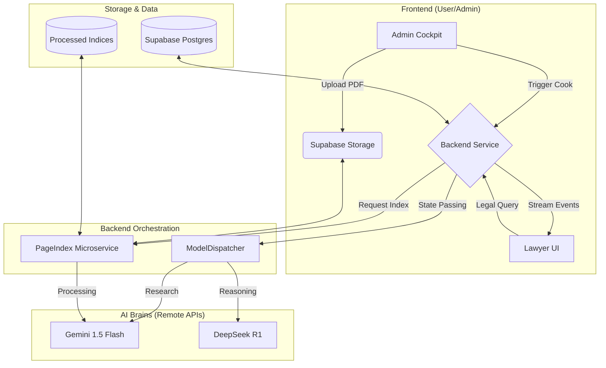

# Lawlify AI Core Engine: Cost-Effective AI Orchestration Report

This report evaluates the most powerful and cost-effective AI models and API providers available in March 2026 for the Lawlify Core Engine. The goal is to achieve 98% precision and "Deep Research" capabilities using free or open-source tiers.

## 🏆 Recommended Hybrid Strategy: "The Triple Threat"

To maximize precision while keeping costs at zero, we recommend a **Tri-Model Orchestration** logic:

| Task Type | Recommended Model | Provider (Free Tier) | Why? |
| :--- | :--- | :--- | :--- |
| **Deep Research & Search** | **Gemini 1.5/2.5 Flash** | Google AI Studio | Built-in "Google Search" tool & 1M-2M context window. Handles large statutory dumps for free. |
| **Legal Reasoning (COT)** | **DeepSeek R1** | OpenRouter / DeepSeek API | Specialized Chain-of-Thought reasoning. Performs on par with GPT-4o for complex legal logic. |
| **Document Generation** | **Llama 3.3 70B** | Groq / Cerebras | Extremely high speed (200+ tokens/sec on Groq). Best for generating long contracts/affidavits instantly. |

---

## 🔍 Detailed Model Analysis

### 1. Google Gemini (The Researcher)
*   **Best For**: Web search, multi-modal (voice/image) analysis, and long-context RAG.
*   **Free Tier Limits**:
    *   **Flash 2.5**: 10 RPM (Requests per Minute) and 1,500 RPD (Requests per Day).
    *   **Pro 2.5**: 5 RPM and 100 RPD (Limited but useful for final verification).
*   **Precision Hack**: Use Gemini's **"Grounding with Google Search"** to verify if a cited act (e.g., "Kenya Finance Act 2024") is the most recent version.

### 2. DeepSeek R1 (The Legal Mind)
*   **Best For**: Analyzing logical fallacies in submissions, interpreting complex cross-references in statutes.
*   **Cost**: $0.55/1M Input (Standard) but widely available via **OpenRouter Free Tier** for specific models.
*   **Advantages**: Its "Reasoning" phase (displayed as `<thought>`) allows the architecture to verify its own logic before outputting a legal opinion.

### 3. Llama 3.3 & Qwen 2.5 (The Automation Workhorses)
*   **Speed (Groq/SambaNova)**: These providers offer Llama 3.3 70B at near-instant speeds for free.
*   **Qwen 2.5 Coder**: Perfect for building internal "Legal Tools" (e.g., automated case trackers) because it excels at generating stable JSON and Python scripts for data processing.
*   **Licensing**: Llama and Qwen weights are open, meaning for Enterprise-level scale, we can host them on local servers (using Ollama) to ensure 100% data privacy.

---

## 🌐 Free API Provider Comparison (2026)

| Provider | Best Model | Daily Limit | Speed |
| :--- | :--- | :--- | :--- |
| **Groq** | Llama 3.3 70B | ~1,000 Requests | **Ultrafast** (Great for UI responsiveness) |
| **OpenRouter** | DeepSeek R1 (Free) | Varies (Generous) | Moderate |
| **Cerebras** | Llama 3.3 70B | 60k Tokens/Min | **Fastest in the world** |
| **Hugging Face** | Mistral / Qwen | 300 Requests/Hr | Good for background tasks |

---

## 📄 Document Extraction & Intelligence (OCR + Layout)

Legal documents are often poorly scanned, multi-column, and table-heavy. We need more than simple OCR—we need "Layout Understanding".

### 1. The Multimodal Giants
- **Gemini 1.5 Flash (King of PDFs)**: 
    - **Strength**: Natively understands 1,000+ page PDFs. Excellent at extracting data from complex tables and even handwritten annotations.
    - **Cost**: Included in the free tier. 
    - **Role**: High-fidelity "Visual Ingestion" for court orders and contracts.
- **Llama 3.2 Vision**:
    - **Strength**: Open-weights. Can be run locally for 100% data privacy (important for client confidentiality).
    - **Role**: Local-first extraction for sensitive documents.

### 2. Specialized OS Extraction (The "Digitization" Layer)
Before the LLM "reads" the page, we should use specialized parsers to clean the data and save tokens:
- **Docling (IBM Research)**: The new gold standard for complex legal PDFs. It converts tables and layouts into structured Markdown with higher accuracy than GPT-4o's native vision.
- **Unstructured.io**: Best for "Data Ingestion" if we have mixed sources (Emails, Word docs, raw images). 
- **DeepSeek-OCR**: Specialized model achieving 98%+ accuracy on text extraction for large batches.

---

## 🏗️ The PageIndex Advantage & Self-Hosting

The "Vectorless RAG" approach is what enables the 98% precision you're looking for. 

### 1. How it works (vs. Vector RAG)
- **Vector RAG (Traditional)**: Turns text into numbers (vectors) and finds "similar" chunks. It often loses context and fails at precise legal citations.
- **PageIndex (Reasoning RAG)**: Builds a **Hierarchical Tree** (Table of Contents) of the document. The LLM then "navigates" the tree like a human expert to find the exact clause. It doesn't use a vector database at all.

### 2. No API Key? No Problem (Self-Hosting)
Since you want to avoid expensive APIs, you can use the open-source PageIndex framework directly from their repository:
- **Repository**: [VectifyAI/PageIndex](https://github.com/VectifyAI/PageIndex)
- **Repo Language**: Python.
- **How to use it for free**:
    1.  **Clone the Repo**: Run the PageIndex service locally on your own machine.
    2.  **Ollama Integration**: Connect PageIndex to **Ollama** (running Llama 3.3 or DeepSeek R1 locally). This means your research engine runs 100% offline and cost-free.
    3.  **MCP Server**: There is a dedicated `pageindex-mcp` if you want to expose it as a tool for external agents.

### 4. How to Add Them? (The Ingestion UI)
- **The Admin Cockpit**: We will build a dedicated **"Knowledge Dashboard"** for you.
- **The Process**:
    1.  **Upload**: You drag a PDF (e.g., *Companies_Act_Kenya.pdf*) into the dashboard.
    2.  **Supabase Storage**: The dashboard automatically saves the PDF to a secure **Supabase Storage Bucket** (`raw-documents`).
    3.  **Indexing (The "Cook")**: You click "Cook" in the UI. This tells our backend to run PageIndex. 
    4.  **Remote Processing**: PageIndex reads the file from Supabase, uses Gemini Flash API to "map" the chapters, and creates a JSON PageIndex file.
    5.  **Save Index**: This JSON index is saved back to Supabase (`processed-indices`).
- **Result**: The document is now "live" and the **CounselAgent** can cite it with page-level accuracy.

---

## 🏗️ System Architecture: The Lawlify Engine

Here is the "Big Picture" of how all components interact:

---

## 👁️ AI Transparency & The "Thinking" Process
### 3. Why it helps Lawlify
- **Granularity**: You can query specific Sections or Clauses (e.g., "What does Article 2(4) of the Kenya Constitution say?") and get the exact text without "hallucinations".
- **Cost**: No vector database search costs or embedding API fees.

---

## 🎥 Video & Audio Intelligence (The "Eyes and Ears")

Based on the **Gemini 1.5 Pro** demonstration (Video ID: `44C8u0CDtSo`), the Core Engine has the potential to move beyond text and "witness" legal events directly.

### 1. Processing Court Hearings & Depositions
- **Native Video Analysis**: Gemini can watch up to 2 hours of video in a single prompt. It can identify:
    - Specific timestamps where a witness changed their testimony.
    - Emotional cues or hesitations during cross-examination.
    - Physical evidence shown to the camera in a remote hearing.
- **Precision Citation**: The model can output **Timecodes** (e.g., "At 12:45, the plaintiff admits to...") as part of its legal research citations.

### 2. Multi-Modal Workflow
1.  **Ingestion**: Feed long court session recordings directly into Gemini Flash/Pro.
2.  **Extraction**: Ask Gemini to extract a "Statement of Facts" with timestamps.
3.  **Reasoning**: Pass that structured statement to **DeepSeek R1** to find legal precedents or logical inconsistencies.

---

## ⚖️ Achieving 98% Precision (Orchestration Loop)

The "Vectorless RAG" strategy remains our strongest asset. Instead of relying on fuzzy embeddings, we will:
1.  **Index by Structure**: Use **PageIndex** to map Acts by Section/Clause.
2.  **Multi-Model Verification**: 
    *   *Step 1*: Gemini fetches the text.
    *   *Step 2*: **DeepSeek R1** reviews the text to ensure it directly answers the user's specific case facts.
    *   *Step 3*: The system cross-references the result against `jurisdictions.json` to confirm the country match.

## 🚀 Next Steps (Discussion Only)
- We should decide if we want to build a **Model Routing Layer** that dynamically picks the free provider with the most quota remaining.
- We can explore **Ollama** for local hosting of these models if the user has a GPU, making the service entirely independent of external API costs.
